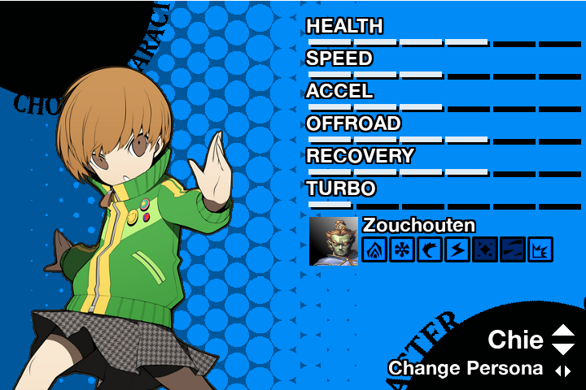

# Persona 4: Racing All Afternoon

## Overview
A racing game parody of the  and ) series by Atlus. Features configurable controls and a story mode. In-game graphics for the racetracks use a pseudo-3D rendering algorithm inspired by .

### Download Links
* **[Windows 64-bit](https://mega.nz/#!E2oWDKpR!iVOooHR6t8sjUutHiOPGtVgbYpjHNT7vbeap6FIIUhs)**
* *(Mac OSX version has not yet been recompiled).*

## Screenshots

## Media Coverage
In 2015, a short review of Persona 4: Racing All Afternoon was featured in an ****. (The article in question references a now-defunct download link. New releases will be given above).

## Dependencies
* **[Pygame](https://www.pygame.org/news)** 1.9.3+
* **[Python](https://www.python.org/)** 3.4+

